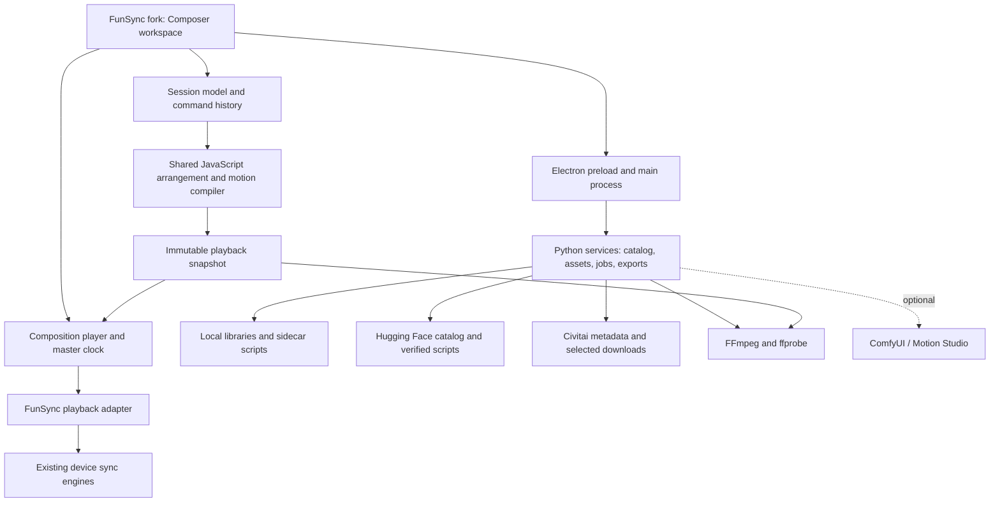

# FunCiv Player — product and implementation plan

Research date: 21 September 2026. This document records the original design and longer-term roadmap. A first working fork now exists; see [README](README.md) for implemented behavior and limits, and [implementation notes](docs/IMPLEMENTATION.md) for the code map and validation. Planned features below should not be read as already implemented.

**Recommendation: develop FunCiv as a focused fork of FunSync Player, with a new Composer workspace.** Reuse FunSync's player, device connections, synchronization engines and desktop shell. Bring in Motion Studio's audio and curve algorithms through a small, versioned adapter. Build the song arrangement, clip selection and session compiler as independent modules.

The intended experience is: **load a song → adjust its sections → choose categories → assemble clips and motion → preview → play or create a temporary video.** A saved session is a small recipe; a rendered video is an optional, disposable result of that recipe.

Companion documents: [function and integration research](docs/REUSE_MAP.md) and [interactive UI study](docs/composer-ui.html). The UI study uses synthetic data and has no playback, network or device integration.

## 1. Findings that determine the design

| Finding | Consequence |
| --- | --- |
| FunSync is an Electron application with a Python/FastAPI service. Its synchronization engines and device managers are primarily JavaScript in the desktop renderer. | Running its Python backend alone will not provide the complete device player. A fork gives us the actual integration points. |
| FunSync already switches synchronization between local playback and remote playback proxies. | Introduce a Composer playback source through that same architectural seam, with explicit source ownership. |
| Motion Studio has beat analysis, audio-derived patterns, section splicing, curve reduction, frame timestamps, editing locks and saved Main scripts. | Reuse those algorithms. Its source/project model needs an adapter for a song containing many separate videos. |
| The inspected Motion Studio timeline primarily combines motion sources into one project's Main tracks. | Its section blending is useful, but a general multi-video arrangement and renderer still need to be built. |
| FunCiv-Data identifies scripts by Civitai ID and variant, with script hashes and source-relative timestamps. It contains no source video or folder/category taxonomy. | Resolve video independently, maintain local category assignments, and validate each script/video pairing. |
| The inspected public snapshot contains 17 videos, 17 variants and 102 axis files. Sixteen variants are drafts; one is approved. Every variant has six axes. | Provide clear draft filtering and show the eligible count. An approved-only selection currently has one dataset candidate, before local imports. |
| The conventional host path `/media/p5/Comfyui/output/sam3d_funscript` was absent. | Discover/configure the real ComfyUI endpoint and storage root; support container-to-host path mappings. Do not hard-code that directory. |
| The local Song Timing project aligns supplied lyrics, including section labels from prompts. | Useful optional section-marker import; it is not an automatic song-structure detector. |

The dataset observations above are from commit `2d1647699add22f33efc085e960090782a9237c9`: [manifest](https://huggingface.co/datasets/ethanfel/FunCiv-Data/blob/2d1647699add22f33efc085e960090782a9237c9/manifest.json), [catalog](https://huggingface.co/datasets/ethanfel/FunCiv-Data/blob/2d1647699add22f33efc085e960090782a9237c9/data/catalog.jsonl). Counts describe this snapshot, not a permanent limit.

## 2. Product scope and terminology

Keep three concepts separate in the data model and UI:

| Concept | Examples | What it controls |
| --- | --- | --- |
| Musical section | Intro, verse, chorus, break, manually named section | A time range in the song |
| Clip category | A user-defined category or imported folder name | Which videos are eligible in that range |
| Motion policy | Follow clip, follow song, fill marked gaps, hold | Where the output motion comes from |

A category is not an intensity setting. A high-energy chorus can use any category, and a given category can appear in both quiet and energetic sections. Preserve musical labels separately from clip tags.

**First usable release:** one song per session, editable sections, local clip library, dataset script lookup, Civitai download of selected missing videos, category matching, deterministic assembly, six-axis-aware compilation, local preview, FunSync device playback, and MP4/funscript export. The first milestone is narrower: two local clips and a song working correctly from end to end.

**Later extensions:** multi-song sessions, automatic structural labels, rolling live rearrangement, additional device protocols, advanced transitions, optional automated clip tagging and direct Motion Studio round trips.

Interpret “temporary for one or two uses” as a retention preference for generated sessions. It should not cause deletion of original songs, imported videos, original scripts or Motion Studio workspaces. A proposed default is manual cleanup; optional expiry and play-count cleanup can be enabled later.

## 3. Why a fork is the preferred integration

| Option | Advantages | Cost / limitation | Decision |
| --- | --- | --- | --- |
| Composer inside a FunSync fork | Existing desktop UI, native file access, settings, device integrations, multi-axis routing and sync ownership | Maintain a small upstream patch set; separate app identity and updates | **Recommended** |
| Browser companion controlling stock FunSync | Can keep the stock installation | Remote protocol expects a registered library video; desktop also resolves that path in its own library. No existing generic arbitrary-session/script API was found. | Useful later, after adding an explicit bridge |
| New desktop shell importing FunSync internals | Maximum UI freedom | Recreates bootstrap, settings, routing, device lifecycle and Electron integration | Too much initial work |
| Extend only the ComfyUI workspace | Closest to the current clip-authoring tools | Leaves ComfyUI running for ordinary playback; does not inherit FunSync's complete player | Keep as an authoring integration |

### Fork boundaries

1. Start from the inspected upstream revision, retain its history and record the upstream remote. Keep application changes in a dedicated Composer module tree.
2. Add `Composer` to the existing navigation. Preserve Library, Playlists, Categories, the player view and the device/settings panels.
3. Put the few necessary hooks in `app.js`; do not accumulate the composer itself inside that already large file.
4. Give FunCiv its own application ID, user-data directory, window identity, log location and update source. Disable the original release updater until FunCiv has its own release channel.
5. Centralize backend discovery and select an available port. The existing launcher defaults to port 5123 and calls `killProcessesOnPort()`; replace that behavior in the fork with ownership-aware startup. The fork must not terminate a running original FunSync backend.
6. Use the fork's existing preload bridge for privileged operations; add explicit Composer methods instead of exposing generic filesystem or command execution.
7. Keep the original library untouched. Import source paths and category associations into the fork; offer a separate migration step for preferences.
8. Track upstream compatibility with a short integration test suite and a vendored-module manifest. Updates should be deliberate and reviewable.

Preserve the existing FunSync and Motion Studio license files and attribution when reusing their code. Record the origin and revision of every vendored module.

## 4. User journey

### A. Create the session

- Choose **New session**, then a local song. Drag-and-drop also works.
- The app probes duration and creates a canonical decoded audio asset for analysis and preview alignment. Keep the original file reference and its fingerprint.
- Display waveform, estimated beat markers and an editable section strip as soon as the lightweight analysis finishes.
- Offer three starting layouts: manual markers; equal musical phrases where a usable grid exists; optional detected structure when that analyzer is installed.
- Show inferred labels as suggestions. The user can rename, split, merge or move section boundaries without rerunning analysis.

### B. Associate categories and motion

- Click a section. Its inspector shows the category pool, clip pacing, motion policy and repeat preference.
- Drag one or more categories onto a section to assign the pool. Multiple categories can have weights.
- Choose whether repeated musical sections reuse the same choices or request fresh clips.
- Optionally set section-level motion strength and cadence. Keep these independent from visual cut frequency.
- Show whether eligible clips are local, require download, or have draft/missing scripts.

### C. Assemble

- **Assemble** produces an edit decision list and motion preview for the current settings and random seed.
- Download only the selected missing videos and scripts, then validate them before the session becomes Ready.
- Review clip blocks on the timeline. Replace a clip, slip its source window, change its fit, or lock it.
- **Another variation** changes only unlocked choices. **Refill section** affects the selected section only.
- Empty pools remain visible with an explanation: wrong category, insufficient duration, review filter, unavailable video, or no compatible script.

### D. Preview and play

- Preview works without a connected device.
- One transport controls song, video composition, playhead and motion preview. Source-clip audition is a separate mode that pauses the arrangement.
- **Prepare playback** compiles one consistent snapshot. The device panel shows preparation and connection state independently.
- The normal player view can present the composition full-screen. Return to Composer without losing the playhead.
- Editing during playback creates a new draft. In the first release, apply it by pausing and preparing the updated snapshot.

### E. Save or discard

- **Save session** saves the recipe, selections, metadata and dependency references.
- **Render video + scripts** produces matching basenames and a render manifest.
- **Keep** pins the generated media. **Clear generated files** removes only app-owned disposable outputs that are not in use.
- Reopening a recipe can rebuild generated media from the same pinned inputs. If an input is missing, show a relink action.

## 5. UI model

Use an **arrangement editor inside the familiar player shell**. The strongest reference is a music arrangement view: visible section locators, aligned lanes, direct range selection and a single transport. Ableton's arrangement locators and automation lanes are useful interaction references; the proposed layout below is our own design. [Ableton Arrangement View](https://www.ableton.com/en/live-manual/12/arrangement-view/)

### Main layout

```text
 FunCiv    Library   Composer   Playlists   Categories       Devices   Settings
 ────────────────────────────────────────────────────────────────────────────
 Session name · Saved       Song: example.flac     Assemble   Prepare   Export
 ┌────────────────┬────────────────────────────────────┬────────────────────┐
 │ LIBRARY        │ COMPOSITION PREVIEW                 │ SELECTED SECTION   │
 │ Local / Dataset│                                    │ Chorus 1           │
 │ Search         │ Video preview + motion simulator   │ Start / end        │
 │ Categories     │                                    │ Category pool      │
 │ Clip cards     │ Current / next clip                │ Cut pacing         │
 │ Availability   │                                    │ Motion source      │
 │ Draft filter   │                                    │ Strength / locks   │
 ├────────────────┴────────────────────────────────────┴────────────────────┤
 │ Play / Pause   00:42 / 03:24    Loop section   Snap: beat/bar/free   Zoom  │
 ├───────────┬─────────────────────────────────────────────────────────────┤
 │ Song      │ waveform, beat grid and time ruler                           │
 │ Sections  │ Intro | Verse 1 | Chorus 1 | Break | Verse 2 | Chorus 2       │
 │ Video     │ [clip A][clip B][clip C][clip D][clip E]                     │
 │ Motion    │ source / audio / hold blocks + visible L0 curve             │
 │ More axes │ collapsed; expand L1 L2 R0 R1 R2                            │
 └───────────┴─────────────────────────────────────────────────────────────┘
 Downloads 1/3 · Analysis ready · Draft changes pending · Device disconnected
```

The [interactive UI study](docs/composer-ui.html) demonstrates section selection, filtering, draft visibility, lock-preserving variation, motion-source changes and a simulated playhead. It is a design artifact, not an implementation of the app.

### Layout behavior

| Area | Specification |
| --- | --- |
| Library panel | Resizable, about 260–320 px initially. Local, Dataset and Selected tabs. Virtualized cards/list for large libraries. |
| Preview | Largest central area. Preserve source aspect ratio. Letterbox by default; crop/fill is an explicit per-session or per-clip setting. |
| Inspector | About 280–340 px initially. Updates to selected section, clip or motion block. No nested modal for routine edits. |
| Timeline | Approximately the lower 35–45% of the window, resizable. One horizontal scroll/zoom controller across every lane. |
| Status | Clear words for Ready, Downloading, Missing script, Draft, Preparing device and Changes pending. Progress jobs can be expanded. |
| Small windows | Collapse library and inspector to drawers; keep transport and timeline available. Start with desktop use at 1280×800 and above. |

Keep FunSync's theme tokens, icon system and localization. Section colors identify sections/categories, not readiness; readiness also uses text and icons. Motion source blocks distinguish Clip, Audio and Hold by labels/patterns as well as color. Numeric timing fields accompany drag handles. Honor reduced-motion settings.

### Core interactions

| Action | Behavior |
| --- | --- |
| Click section | Selects it and shows settings; does not start playback |
| Double-click section | Seeks to its start; loop is a separate toggle |
| Drag section boundary | Adjusts the adjoining range, preserves overall song coverage, snaps to selected grid |
| Split at playhead | Creates two sections with inherited category settings; generated placements become stale only where affected |
| Drag clip into timeline | Creates a placement with its linked script and provenance |
| Slip clip | Changes source in/out while preserving its song-time slot and matching script trim |
| Change speed | Changes video and clip-derived motion together; song tempo remains unchanged |
| Lock | Locks selected clip identity, trim or whole placement; the inspector makes scope explicit |
| Refill / variation | Recomputes unlocked parts only; seed is saved and undoable |
| Undo / redo | Includes section edits, generation, replacements, category assignments and motion-policy changes |
| Space | Play/pause when focus is not in a text field; reuse existing FunSync shortcuts where they already apply |
| Seek/loop | Uses the shared session clock; no separate restart of each device script |

Use ordinary controls for **Follow clip**, **Follow song**, **Fill marked gaps**, and **Hold**. Put detailed beat-shape controls in an expandable panel. Avoid requiring node-graph knowledge for ordinary composition.

### Empty and failure states

- No song: one prominent load action, recent sessions below it.
- No categories: import a local folder or create a category and tag clips.
- No approved matches: show the exact eligible count and an explicit Include drafts control.
- Missing original video: retain the placement and show Download/Relink/Replace.
- Duration mismatch: identify the conflicting local copy; offer another copy or manual alignment. Never silently stretch it to “fix” identity.
- Analysis unavailable: manual sections remain usable; optional model installation is separate.
- Device absent: preview and export remain usable.
- Export error: preserve the session and completed cache files; retry is tied to the same snapshot.

## 6. System architecture



### Responsibility boundaries

| Layer | Owns | Does not own |
| --- | --- | --- |
| Composer UI | Selection, inspectors, gestures, waveform and timeline drawing | Download credentials or physical-device timing |
| Session model | Sections, category rules, placements, locks, seed, revisions | Mutable downloaded bytes |
| Composer core | Validation, source-time mapping, deterministic selection and compiled curves | DOM, network requests or device connections |
| Electron main | Native dialogs, restricted IPC, credential storage, process lifecycle | Arrangement rules |
| Python service | Catalog database, asset resolution, jobs, probing, downloads and FFmpeg execution | A second implementation of the motion compiler |
| Composition player | Song clock, video-slot scheduling, playback state | Per-device transport protocols |
| FunSync adapter | Bind clock/script snapshot to existing sync engines and ownership rules | A second independent output scheduler |
| Optional Comfy adapter | Discover workspace capabilities, open source editor, import an explicit saved revision | Required infrastructure for normal session playback |

Prefer native ES modules in the initial fork to match its existing code. Add typed interfaces through JSDoc and schemas; a framework rewrite is not a prerequisite. Keep the mathematical compiler pure so it can run in a renderer worker and a Node utility process. Electron supports Node-enabled utility processes and message ports for this separation. [Electron utilityProcess](https://www.electronjs.org/docs/latest/api/utility-process)

### Suggested module structure

```text
renderer/composer/
  composer-view.js          section-inspector.js     library-panel.js
  timeline-view.js          waveform-view.js         preview-view.js
  session-controller.js     composer-transport.js    funsync-adapter.js
packages/composer-core/
  schema.mjs               commands.mjs             time-map.mjs
  arrange.mjs              compile-motion.mjs       validate.mjs
  coverage.mjs             provenance.mjs           diagnostics.mjs
vendor/motion-studio/
  selected .mjs modules, upstream revision, license, adaptation notes
electron/
  composer-ipc.js          composer-worker.js        asset-handles.js
backend/funciv/
  catalog.py              local_library.py          dataset_client.py
  civitai_client.py       comfy_adapter.py          media_probe.py
  jobs.py                 sessions.py               render.py
  cache.py                migrations/
```

All names in this tree are proposed new modules, not existing APIs.

## 7. Data model and persistence

Use SQLite for the local catalog/jobs/cache inventory, and versioned JSON for portable session recipes. Save JSON atomically, retain recent revisions, and reject stale writes by expected revision. Database rows index recipes; the recipe remains independently readable.

| Entity | Essential fields |
| --- | --- |
| `SongAsset` | ID, original path/reference, canonical-audio hash, duration, sample rate, decoder settings, analysis reference |
| `SongAnalysis` | Version, audio hash, analyzer/version/parameters, waveform levels, onsets, beats, optional downbeats, energy curve, suggested boundaries |
| `Category` | Stable ID, label, color, optional parent, source (`manual`, `folder`, `imported`) |
| `ClipIdentity` | Stable local ID, optional Civitai ID, user tags and source attribution |
| `VideoAsset` | Identity ID, local path or owned-cache path, content hash, ffprobe streams/timebase, duration, dimensions, availability |
| `ScriptVariant` | Identity ID, variant ID, review status, quality, origin, dataset commit if applicable, axis descriptors, source timing |
| `ClipScriptBinding` | Exact video asset, exact variant, alignment/verification state, optional explicit offset, evidence and user override |
| `MotionCoverage` | Variant+axis, ranges with provenance: authored, generated, user-marked missing, or unknown |
| `Section` | ID, start/end, musical label, category rules, motion policy, cadence, locks |
| `Placement` | Song range, video asset, source range, rate, script binding, section ID, transition and lock state |
| `MotionBlock` | Song range, source kind, generation parameters, source variant/range if applicable, overrides |
| `Session` | Schema, ID, revision, song, sections, placements, seed, policies, retention preference, asset references |
| `PlaybackSnapshot` | Session revision, compiler version, resolved assets, compiled axes, diagnostics, checksum |
| `RenderJob` | Snapshot hash, settings, progress, owned outputs, failure reason, cancellation state |

Store editorial timestamps as integer microseconds and retain source frame/PTS information where relevant. Convert to integer milliseconds only at the funscript boundary. Never use a clip number or a guessed fixed FPS as its authoritative time.

Suggested portable recipe excerpt:

```json
{
  "schema": "funciv-session/1",
  "id": "session-example",
  "revision": 1,
  "seed": 4081,
  "song_asset_id": "song-1",
  "sections": [
    {
      "id": "section-chorus-1",
      "start_us": 48000000,
      "end_us": 72000000,
      "label": "Chorus 1",
      "categories": [{"id": "category-a", "weight": 1}],
      "motion_policy": "clip_with_marked_gap_fallback",
      "cut_grid": {"unit": "beats", "count": 8},
      "locked": false
    }
  ],
  "placements": [],
  "retention": {"mode": "manual", "pinned": false}
}
```

### Invariants

- Sections form a non-overlapping partition of the selected song range; intentional inactive sections still exist as sections.
- Placement source ranges stay within the probed asset. Rate is positive and within the selected user range.
- A playback snapshot refers to exact variants and assets. A dataset refresh does not mutate an open session.
- Variants never borrow axes from another variant merely to fill missing axes.
- Video changes, trims and speed changes invalidate the corresponding compiled motion.
- Actions are finite, bounded to 0–100, sorted, unique at millisecond timestamps and inside the export range.
- Every generated range records how it was generated. Manual overrides and intentional holds survive regeneration.
- Locks constrain generation; they do not prevent the user from deliberately editing that item.

## 8. Local library, dataset and Civitai integration

### Local library first

1. Register user-selected video roots. A root can be the library used by Motion Studio; it need not be the node's source-code directory.
2. Scan incrementally by path/size/mtime; probe only changed media in a bounded background queue.
3. Recognize existing `_civitai_<ID>_` filenames and managed download records. Keep multiple local copies as separate assets under one logical identity.
4. Import adjacent `.funscript` and known multi-axis suffixes. Files with no Civitai ID remain usable local clips.
5. Derive initial category suggestions from subfolders. Store later tagging edits in FunCiv's catalog without moving files.
6. Prefer the exact local copy with a verified script binding. Cache SHA-256 results after first use; quick fingerprints are an optimization, not proof of identity.
7. Use directory changes or explicit Refresh to reconcile; a temporarily unmounted source is Offline, not deleted.

### Dataset client

1. Resolve the dataset revision to a full commit SHA.
2. Fetch `manifest.json` and `data/catalog.jsonl` at that commit; verify the catalog against the manifest.
3. Validate the schema before importing into a staging transaction. Keep the prior catalog usable if refresh fails.
4. Retain every variant. Prefer approved, then quality, with deterministic ties according to the dataset contract; allow an explicit variant override.
5. For direct ID lookup, compute `SHA256(UTF8("civitai:" + decimal_id))`, then request `index/<first-two-hex>/<hash>.json`.
6. Fetch only required axes from the same commit. Verify each downloaded script's SHA-256 and action schema before cache promotion.
7. Display review status and action coverage. Quality `0` means unrated, not a measured failure score.
8. Keep source-attribution details in the recipe and export manifest. The dataset contains scripts, not a license grant for separately obtained videos.

Use `hf_hub_download(repo_type="dataset", revision=<full SHA>)` or equivalent pinned HTTPS requests. The Hub's download API supports explicit revisions and selective files. [Hugging Face download guide](https://huggingface.co/docs/huggingface_hub/guides/download)

### Resolve a selected missing video

```text
Selected placement
  → exact usable local asset?
  → already verified FunCiv cache asset?
  → Civitai metadata for this ID, using configured account/API access
  → supported full-size/original media download
  → temporary .part file
  → validate container + streams + duration + script compatibility
  → atomic promotion to owned cache
  → Ready, or a specific replace/relink problem
```

Reuse the local node's tested URL handling and download validation, with a storage adapter. Its `CivitaiLibrary` is tied to FolderStore and review ownership; copying that whole class into a general player would couple unrelated responsibilities.

Use cursor pagination, explicit rating filters, cancellation, bounded concurrency and `Retry-After` backoff. Preserve server ordering in browse results. Authentication errors, unavailable items and transient failures get different states. Credentials go to the metadata API, not arbitrary media URLs. Current upstream images API code exposes `imageId`, `type`, cursor pagination and browsing-level filters. [Civitai images endpoint](https://github.com/civitai/civitai/blob/main/src/pages/api/v1/images/index.ts)

A matching Civitai ID and duration are necessary checks but not proof that a local re-encode or edit is synchronized. Record `unverified`, `duration-compatible`, `user-confirmed` and stronger identity evidence distinctly. A future dataset schema could add a source content fingerprint or normalized timing signature; the current dataset does not provide one.

### Category ownership

Priority is explicit user tags, imported folder tags, then optional remote-tag suggestions. Dataset refresh never replaces user tags. Matching starts with user categories; automatic classification is a separate later feature with reviewable suggestions.

## 9. Song analysis and sectioning

### Baseline without additional ML models

- Normalize audio timing with one canonical decode. Use the same origin for analysis, preview and export.
- Reuse Motion Studio's `analyzeBeatAudio()` for waveform/onsets/beats and its feature extraction for energy/shape.
- Add editable section markers and user-set BPM/beat origin. A weak estimate must not prevent manual work.
- Offer phrase-length cuts from a reliable beat grid. If bar boundaries or meter are unknown, label them beat groups; do not pretend every fourth detected beat is a known downbeat.
- Suggest changes from energy/texture novelty as unlabeled boundaries. Let users preview and accept them.
- Keep transient onsets, periodic beats, downbeats and structural section boundaries as separate arrays.

### Optional structural analyzer

Evaluate `allin1.analyze()` in an isolated worker environment. It produces beat/downbeat positions and labeled structural segments, making it a good candidate for verse/chorus suggestions. Its documented installation includes PyTorch, NATTEN and madmom, so compatibility and packaging need a spike before making it a default. [All-In-One repository and installation](https://github.com/mir-aidj/all-in-one)

The lightweight alternative is feature-based segmentation with librosa: build beat-synchronous features and use `segment.agglomerative()` for contiguous partitions. This produces boundaries, not trustworthy semantic verse/chorus labels. [librosa temporal segmentation](https://librosa.org/doc/0.11.0/generated/librosa.segment.agglomerative.html)

Cache analysis by canonical audio hash, analyzer version and settings. Never rerun a model just because category assignments changed. The app remains usable if optional inference fails or a GPU is occupied by ComfyUI.

### Existing song-related tools

The local `ComfyUI-Song-timing` node can import lyric-aligned boundaries from `segments_json` when the user already knows the lyrics. Preserve its section metadata and confidence as suggestions; it does not replace beat analysis. A supplied drum stem improves rhythm extraction without requiring source separation in this app.

Do not introduce an LLM into the initial selection or timestamp pipeline. The required operations are deterministic and inspectable. Later, a text instruction could produce proposed category rules for user review.

## 10. Clip selection and arrangement

### Candidate filtering before ranking

Exclude unavailable or incompatible candidates, then apply category rules, review policy, requested duration and per-session exclusions. An explicit video-only placement may lack a script if its motion policy uses audio or hold. A clip with a missing script must not silently pass as motion-tracked.

Rank eligible candidates using configurable factors:

| Factor | Purpose |
| --- | --- |
| Category match | Satisfy the chosen pool |
| Script review and quality | Prefer reviewed work while respecting user policy |
| Source duration fit | Minimize extreme speed changes and awkward repetition |
| Motion energy/cadence fit | Match the requested feel independently from visual tags |
| Local availability | Prefer already usable files when quality is comparable |
| Recent use | Avoid immediate or excessive repeats |
| Join cost | Prefer source endpoints that can connect with a small motion change |
| User pin/lock | Deterministic hard constraint where specified |

Start with greedy weighted selection plus a short look-ahead; log a concise reason for each choice. A complex optimizer is unnecessary before observing real usage. Keep seed, candidate ordering and scoring version in the recipe.

### Placement rules

- Make visual cuts on selected beats/bars/seconds, with section ends as hard boundaries.
- Prefer a new suitable clip or a different source window before repeating an obvious loop.
- Default to trim at normal source speed. Offer modest speed fitting and loop as explicit alternatives.
- A provisional automatic speed range could be 0.85×–1.15×, configurable after preview; it is a product choice to validate, not a tested optimum.
- Keep source audio muted by default and use the chosen song. Source audio mixing is an optional later control.
- If an arrangement cannot fill a slot, show the unresolved slot or use a specifically selected visual fallback; do not leave the output state ambiguous.
- Model lock scope separately for identity, source trim and full placement.

## 11. Motion compiler and synchronized timing

### One transformation for video and clip-derived scripts

For a placement beginning at song time `T`, source in-point `S`, and playback rate `r`:

```text
source_time = S + (song_time - T) * r
song_time   = T + (source_time - S) / r
```

All values use the same unit inside this mapping. For example, a source action at 5.0 seconds with source-in 2.0 seconds, song start 30.0 seconds and rate 1.25 lands at 32.4 seconds. The video must show source time 5.0 seconds at exactly that song time.

Use half-open placement intervals `[start, end)` and a defined final-end sample. Evaluate the source curve at trimmed boundaries, preserve relevant interior actions and then transform timestamps. Resolve rounding collisions deterministically after mapping; keep explicit transition/section boundaries protected. Do not independently stretch only the motion to fit the music while still calling it clip-synchronized.

### Compilation pipeline

1. Freeze a session revision and resolve all asset/script identities.
2. Validate section coverage, placement bounds and every required source range.
3. Select the appropriate axis set from each single chosen variant.
4. Normalize any supported script range/inversion semantics once, with documented compatibility tests.
5. Trim and remap clip actions onto song time, including explicit source offsets.
6. Generate song-derived motion for blocks that request it.
7. Apply manual overrides and locks.
8. Join neighboring blocks with the selected cut/blend rule; clip-derived exactness applies outside deliberate blend windows.
9. Reduce redundant points while preserving timing boundaries and extrema.
10. Produce the canonical motion snapshot, validation diagnostics and derived motion statistics.
11. Apply the chosen device output policy once, at a defined boundary. Keep authored curves separate from output-limited variants.
12. Send that immutable snapshot to preview/playback/export. Recompilation creates a new snapshot rather than mutating the playing one.

Reuse `evaluate()`, `reduceActions()`, `spliceActions()`, `generateBeatSection()` and `insertBeatSection()` where their assumptions fit. In particular, `spliceActions()` joins curves already on one time axis; it does not itself implement source-video retiming.

### Motion source policies

| Policy | Behavior |
| --- | --- |
| Follow clip | Preserve the clip's motion timing under the video's trim/rate map |
| Follow song | Use the selected beat/shape generator for the range; video is illustrative |
| Fill marked gaps | Keep source motion and fill only explicitly missing/eligible ranges |
| Hold | Preserve a deliberate constant/rest value; do not auto-fill |
| Blend | An advanced, explicit weighted mixture of clip and song-derived motion |

**Flat motion is not automatically missing motion.** Holds may be intentional, and the public dataset's first/last action timestamps do not provide reliable internal tracking-quality masks. Until richer provenance exists, let users mark gaps or opt into a reviewed heuristic. Do not overwrite a flat authored section simply because an audio rhythm exists.

Generate L0 first for audio-only fallback. Other axes stay at a configured neutral/held state unless explicitly authored or generated. A rotational axis missing from one variant should not borrow a different clip's axis.

### Join behavior

Separate visual cuts from motion joins. A hard video cut can still need a short curve transition. Start with a configurable 100–250 ms blend proposal and evaluate it on real examples; this range is an initial tuning choice. A boundary that must preserve an exact source event can disable or shorten the blend.

Clip/video crossfades are a later feature. They require real source handles on both sides and a motion ownership rule through the overlap. The song timeline must remain fixed; adding a crossfade must not silently shorten the composition.

## 12. Playback and “live” behavior

Distinguish three capabilities in the product:

1. **Live preview:** changing a draft updates preview curves and placements.
2. **Prepared session playback:** the chosen song plays against a complete compiled script and video schedule without first rendering a final movie.
3. **Rolling live rearrangement:** future clips and motion can be replaced while a session is playing.

Deliver the first two before the third. They satisfy immediate playback without requiring constant cloud script replacement.

### Master clock

Use a single song media element as the authoritative arrangement clock. Wrap it in a `ComposerPlaybackSource` that provides the player-shaped interface the existing sync engines expect: `currentTime`, `duration`, `paused`, `playbackRate`, and the relevant media events. The existing `RemotePlaybackProxy` demonstrates this interface, but its remote timestamp extrapolation should not become the local song clock.

Two muted video elements can alternate active/preloaded clips for hard cuts. Preload the next placement, seek it to the needed source time and wait for usable decoded frames before switching. For an unprepared boundary, pause the song and the shared playback source, resolve the stall, then resume together. Never let device time advance through an unresolved visual stall.

Use `requestVideoFrameCallback()` and its presentation `mediaTime` for video drift observation; animation frames draw UI only. Source rate remains the planned rate. If drift exceeds a measured threshold, re-anchor video to the master or pause to recover rather than silently changing its relationship with motion. [Video frame callback API](https://developer.mozilla.org/en-US/docs/Web/API/HTMLVideoElement/requestVideoFrameCallback)

Validate background/minimized-window behavior and native codec support. If seamless multi-element preview is unreliable for a format, prepare a local proxy or render the session first. This fallback is part of the product, not a hidden failure.

### FunSync adapter

- Extract a small source-binding operation from the existing local/remote setup paths: stop previous engines, detach listeners, load axes, bind the new clock, prepare device scripts, then signal Ready.
- Audit every required property/event rather than assuming a three-property mock can replace all HTML video behavior.
- Register Composer with the session ownership system. Exactly one source controls output: local player, Composer, web remote or VR.
- Pause/seek/ended/error operations invalidate pending work using monotonically increasing generation IDs, following existing FunSync practices.
- Composer-generated motion is complete: avoid applying an additional automatic FunSync gap filler on top unless the user explicitly enables it.
- Preserve FunSync's existing per-device offsets, transforms, connection status and stop behavior. Keep device-specific transformations from being applied twice.

### Device capabilities and edits

| Existing path | First-release strategy |
| --- | --- |
| Buttplug | Compiled in-memory actions against Composer's clock; rebind/reload while paused |
| TCode | Same strategy, including six-axis assignment and existing output settings |
| Handy HSSP | Prepare/upload the full song script once; start/pause/seek via the existing engine |
| Handy HDSP | Reuse the existing path where suitable, subject to the transport's actual timing limits |
| Autoblow and other cloud paths | Reuse existing prepared-playback capabilities; test before claiming parity |

The local FunSync code already distinguishes HSSP from its HDSP path for rate changes. New Handy API documentation also lists HSP buffering operations; that is a possible later streaming route, not an integration already present in the inspected fork. [Handy REST API](https://www.handyfeeling.com/api/handy-rest/v3/docs/)

For rolling edits later, define a committed playback horizon and replace only future blocks at a boundary after the relevant device acknowledges the new data. Devices without supported incremental updates get Pause and prepare. Do not promise seamless live edits across every backend.

## 13. Motion Studio integration

### First integration: source assets and algorithms

- Import local reviewed exports and dataset scripts without requiring ComfyUI to run.
- Vendor a pinned set of pure JavaScript functions with their tests and attribution. Adapt interfaces in FunCiv, not by editing the user's existing node installation.
- Reuse audio timing, shape generation and joining in the new UI. Do not embed the entire viewer as the main Composer.
- Treat saved source scripts as immutable session inputs; edits create a new variant or imported revision.

### Optional connected integration

The existing node provides folder, Civitai, timeline/editor, video/audio and asset routes; their exact current paths are recorded in the [reuse map](docs/REUSE_MAP.md).

Proposed flow: select a placement → **Edit source in Motion Studio** → open its known folder/editor project → save there → explicitly import that saved revision into FunCiv → recompile affected ranges. Do not let background polling replace a playing script.

Use the existing editor's revision checks for writes. Avoid direct mutation of ComfyUI's saved JSON. The first connected version can be read-only plus open-editor links; deeper writes need a documented exchange format and capability handshake.

Add a small optional node-side endpoint for capability/version discovery and registered-library discovery if no existing public route provides it. That endpoint is **proposed**, not available today. Paths returned from a remote/containerized ComfyUI require media URLs or a configured prefix mapping before desktop use.

Automatic new motion extraction from unprocessed clips belongs to a later queued integration. Ordinary playback and existing-script composition should remain independent of GPU inference.

## 14. Rendering and temporary storage

### Export pipeline

1. Freeze one validated playback snapshot.
2. Normalize required video segments with FFmpeg: source trim, timestamp reset, rate map, chosen output dimensions/aspect policy, pixel format and frame rate.
3. Assemble video segments using their absolute song placements. Use hard cuts first; normalize formats before concatenation.
4. Add the canonical song audio at its defined origin, with the selected gain/fades. Match the chosen session duration.
5. Export all compiled axes beside the video, with identical basenames and standard suffixes.
6. Write a manifest with the session revision, asset identities, dataset revision, source ranges, compiler version and output checksums.
7. Probe final streams and duration. Compare sampled output frames/actions against the same timeline mapping used in preview.

Relevant FFmpeg building blocks are `trim`, `setpts`, `scale`, `pad`, `fps`, `concat`, `atrim` and `asetpts`. Later `xfade` requires compatible input frame rates, timebases, sizes and pixel formats. This is why arbitrary downloaded files cannot simply be concatenated without inspection. [FFmpeg filters](https://ffmpeg.org/ffmpeg-filters.html)

Represent output-frame boundaries consistently for fractional source rates and VFR. Target-frame rounding is expected; preserve millisecond funscript timing relative to the actual song timeline. Do not accumulate a separate rounding error for each clip.

Start with a broadly playable H.264/AAC MP4 preset; support original audio or other codecs as explicit alternatives after playback testing. Hardware encoding is optional; select it only after detecting support and retain a software fallback. Short proxies and normalized segments can be reused by snapshot/input hashes.

### Cache ownership and cleanup

Keep separate inventories for external source files, downloaded source media, verified scripts, audio analysis, proxies, render segments and final temporary sessions. Record ownership, reference counts, bytes, last use and pins.

Default cleanup removes only unused app-owned derived files on explicit request. Optional policies can expire renders after a time or after one/two completed plays. A seek to the end is not a completed play; define completion from actual watched/listened duration and keep paused/resumable sessions protected. A recipe stays until the user deletes it.

Cancellation kills only the render process launched for that job, removes its unfinished output, and leaves shared cache items usable. Disk-budget checks happen before large downloads/renders. All final outputs use temporary names and atomic promotion.

## 15. Service contracts and job states

These are proposed FunCiv contracts; they are not existing FunSync endpoints.

| Contract | Purpose |
| --- | --- |
| `GET /funciv/capabilities` | Schema versions, formats, optional analyzers, backend capabilities |
| `POST /funciv/libraries` | Register a selected root through an approved asset handle |
| `POST /funciv/jobs/scan` | Scan/update a root asynchronously |
| `GET /funciv/clips` | Paginated filter/search with status and variant summaries |
| `POST /funciv/jobs/dataset-refresh` | Import a pinned catalog transactionally |
| `POST /funciv/jobs/resolve-assets` | Fetch/probe/verify selected missing assets |
| `POST /funciv/jobs/analyze-song` | Analyze canonical audio with cancellation |
| `GET/PUT /funciv/sessions/{id}` | Read/save recipe with expected revision |
| `POST /funciv/jobs/render` | Render an immutable compiled snapshot |
| `GET /funciv/jobs/{id}` | Progress, result handles, structured errors |
| `POST /funciv/jobs/{id}/cancel` | Cancel owned work |
| `WS /funciv/events` | Job, catalog and device-preparation status; not device motion scheduling |

Selection and curve compilation call the shared core directly in a worker. Native dialogs, credentials and export destinations go through narrow preload methods. Bind mutation services to local access with a per-launch session credential; do not inherit an unrestricted LAN mutation endpoint merely because the original player exposes media remotely.

Job lifecycle: `queued → running → completed | failed | cancelled`; downloads add `resolving`, `downloading`, `verifying`. Playback lifecycle: `draft → resolving → compiling → preparing → ready → playing/paused → ended`. An edited draft and a playing snapshot can coexist, but their revisions must be visible.

Structured errors should have stable codes such as `ASSET_OFFLINE`, `REMOTE_UNAVAILABLE`, `SCRIPT_HASH_MISMATCH`, `VIDEO_TIMING_MISMATCH`, `EMPTY_CATEGORY`, `STALE_SESSION_REVISION` and `DEVICE_PREPARE_FAILED`, plus short user-facing recovery actions.

## 16. Implementation sequence and acceptance criteria

| Phase | Work | Exit criterion |
| --- | --- | --- |
| 0 — Integration spike | Fork shell/identity, configurable backend port, source interface audit, one synthetic session, vendored math spike | Original FunSync can coexist; synthetic song clock drives simulator and mock device; no unwanted original-library writes |
| 1 — Local vertical slice | Song import, manual sections, local videos/sidecars, two placements, source trim mapping, compiled L0, hard-cut export | A song with two local clips produces matching preview, MP4 and funscript; save/reopen reproduces it |
| 2 — Composer experience | Timeline, category mapping, candidate filters, deterministic selection, locks, undo, source-policy blocks | User can assemble/revise a multi-section session entirely through the UI and recover after restart |
| 3 — Existing ecosystem | Dataset client, explicit drafts, variants, six axes, local ID matching, selected missing-video downloads | A pinned dataset variant binds to the correct available video; corruption/mismatch/unavailability have working recovery |
| 4 — Music and motion | Motion Studio audio analysis/patterns, phrase section suggestions, marked-gap fill, better joins | Generated audio motion and clip motion share the song clock; marked holds survive regeneration |
| 5 — Prepared playback | Dual-video scheduler, Composer source ownership, FunSync device preparation, seek/stall behavior | Full song plays with verified timing; stops/seeks work across supported tested device paths; render fallback works |
| 6 — Temporary-session release | Export queue, cache budget, Keep/clear controls, packaging, optional expiry, diagnostics | A reproducible session can be prepared, used, kept/discarded and reopened without damage to sources |
| 7 — Advanced additions | Optional structural model, Comfy editor round trip, future-only live edits, crossfades, multi-song recipes | Each capability has its own tested contract and can be absent without breaking baseline use |

Run the minimum playback/source-binding experiment in Phase 0 even though polished playback comes later. It is the most consequential integration uncertainty and should not wait until after a complete timeline UI.

Suggested first implementation batches:

1. Fork identity, process ownership and Composer navigation with an empty state.
2. Versioned recipe, asset model, command history and exact time-map tests.
3. Two-clip compiler and offline export with synthetic fixtures.
4. Song waveform, section editing and category inspector.
5. Local library importer and deterministic arrangement.
6. Dataset/Civitai resolvers and review-status UI.
7. Audio-derived motion, joins and multi-axis compilation.
8. Prepared playback and actual device validation.

These are dependency-oriented work packages, not calendar promises. Estimate calendar time after the Phase 0 spike and inspection of packaging/runtime constraints.

## 17. Validation plan

### Mathematical and contract checks

- Known source actions under trim, offset, acceleration/deceleration by constant rate, and section concatenation map to exact expected song times.
- Boundary interpolation, one-millisecond collisions, short clips, empty arrays, invalid numeric values and fractional-frame durations are covered.
- Six axes come from one variant and preserve synchronization under one map.
- Same seed + same snapshot yields identical placements and exported scripts; locked placements survive rerolls.
- Blend windows do not modify unrelated ranges. Source holds and explicit gaps have different behavior.
- Hash mismatch, unsupported dataset schema, interrupted refresh and mixed-commit fetches cannot become Ready assets.

### Integration checks

- Use short synthetic numbered-color videos with known timestamps and click-track audio. Validate matching source frame and motion position at cuts, seeks and rate changes.
- Exercise local-first resolution, duplicate Civitai IDs, offline drives, renamed clips, partial downloads, expired URLs, 429/503 and cancellation.
- Verify imported local scripts, imported Motion Studio revisions and dataset variants keep distinct provenance.
- Test pause during device preparation, seek during preparation, quick repeated seeks, source switching, disconnect and reconnect.
- Test missing codecs, VFR inputs, mixed dimensions/rates, source audio offsets, portrait clips and a short last section.
- Confirm preview and rendered output use the same snapshot. Re-rendering must not reroll clip choices.
- Test fork startup while original FunSync is open; the original process, settings and update source remain independent.

### UI and performance checks

- Use existing FunSync Vitest/Playwright patterns and reuse relevant upstream Motion Studio fixtures.
- Smoke-test keyboard editing, text-field shortcut isolation, resize, scaling, focus visibility, empty states and stale-job results.
- Benchmark one 3–5 minute song, a 30-minute stress session, six axes, and a 10,000-clip catalog. Targets are provisional: responsive selection/scrolling, cancelable analysis, bounded memory and no playback work blocked by catalog updates.
- Measure cut timing and drift using synthetic fixtures before setting thresholds. A reasonable initial target is video alignment within one output frame under nominal conditions; device transport latency is measured separately.
- Record timing diagnostics without credentials or unnecessary private filenames. Include source revision and snapshot hash in bug reports.

## 18. Decisions to validate during the first spike

| Question | Proposed starting decision |
| --- | --- |
| Which hardware must work first? | Preserve all existing paths, validate simulator first and the user's primary physical device next; do not claim untested hardware parity |
| Separate app or stock-player extension? | FunSync fork with Composer navigation and independent app identity |
| Does the user want automatic verse/chorus labels immediately? | Manual/phrase sections first; model-based structure is optional |
| Should drafts be eligible? | Visible, explicitly enabled choice; approved-only remains available |
| What is “no motion”? | Marked missing coverage or explicit user policy, never merely a flat curve |
| What exactly does “live” require? | Immediate prepared playback first; rolling edits follow capability-aware testing |
| Must ComfyUI be running? | Only for connected source editing or new inference |
| When are temporary files removed? | Manual cleanup initially; opt-in lifetime/play-count policy later |
| How much source speed adjustment is acceptable? | Normal-speed trimming by default, optional bounded fitting |

The plan can proceed with these defaults. None of them requires choosing a device, installing a structural model, downloading an entire video library, or publishing a fork during planning.

## 19. Research limits

The local source and public dataset metadata were inspected. This planning work did not run FunSync, ComfyUI, real device playback, Civitai downloads, model inference or timing benchmarks. Function reuse and fork integration are grounded in source inspection; runtime compatibility, automatic section quality and timing targets remain implementation acceptance work.
