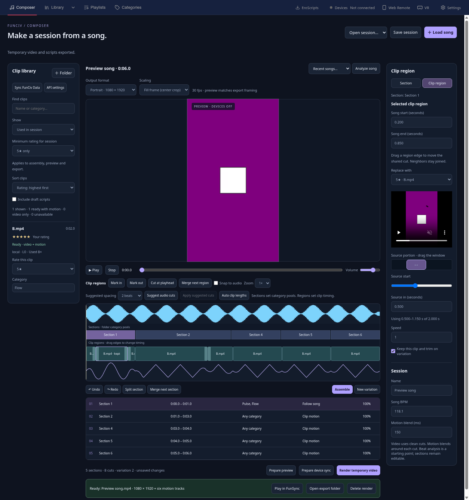

# FunCiv Player

Compose a session from **a song → sections → categories → video clips and synchronized motion**. Preview the assembled timeline live or render a disposable MP4 with six matching funscripts.

This is an early working fork of [FunSync Player](https://github.com/DaveMakesWaves/funsync-player). It adds a **Composer** workspace and reuses the player, device transports, and selected audio/curve algorithms from [ComfyUI-Sam3D-to-Funscript](https://github.com/ethanfel/ComfyUI-Sam3D-to-Funscript). The original Library, Playlists, Categories, and video player remain available.



## Run locally

Requires Node.js 22.15+ (tested with 24), Python 3.10+, FFmpeg 6+ and FFprobe on `PATH`, and a desktop environment for Electron. On this workstation, dependencies have already been installed in this checkout.

```bash
cd /media/p5/FunCiv-player
npm start
```

For a fresh checkout:

```bash
npm ci
python3 -m venv backend/.venv
backend/.venv/bin/python -m pip install -r backend/requirements.txt
npm start
```

On Windows, use `backend\.venv\Scripts\python.exe` for the Python commands. `FUNCIV_PYTHON` can select a different interpreter. If your npm policy suppresses Electron's install script, run `node node_modules/electron/install.js` once after `npm ci`.

FunCiv uses its own `funciv-player` application data directory. It starts its backend on loopback port 5124, choosing an available port if occupied. It does not terminate another application's server or import your existing FunSync settings. `FUNCIV_USER_DATA` overrides the data directory for development. Automatic binary updates are disabled until this fork has a tested release feed.

## Make a session

1. Open **Composer**, then **Load song**. Audio is converted once to a cached stereo 48 kHz WAV. Recent imported songs are reusable.
2. Click **＋ Folder** and choose the folder containing your downloaded clips. For your ComfyUI installation under `/media/p5/ComfyUI-Sam3D-to-Funscript`, choose the actual video library/output folder configured in its Folder node. Subfolders become initial categories. Change a clip's category directly in the library.
3. Click **Analyze song** for an energy waveform and estimated BPM. Sessions start with six equal sections; rename them, change an end time, or click the waveform and use **Split section** / **Merge next section**.
4. Select each section, check one or several **Folder categories**, and choose its motion policy:
   - **Clip motion:** use the clip's existing script.
   - **Follow song:** generate L0 motion from the song's tempo and energy, including when the clip has no script.
   - **Clip + marked gaps:** replace only the ranges you explicitly mark with song motion.
   - **Neutral hold:** keep all axes at their neutral position.
5. Click **Assemble**. **New variation** changes unlocked choices; **Keep clips on variation** retains a section's placements. Click a clip on the timeline to replace it or adjust its source start and speed. Invalid source ranges are rejected.
6. **Prepare preview**, then **Play**. The song is the master clock; two muted video decoders prepare consecutive cuts. A decoder stall pauses the audio clock. Editing pauses playback and invalidates its prepared snapshot. Undo/redo is available.
7. **Save session** keeps the recipe, song analysis, and asset bindings. Reopening a saved recipe rejects changed media/scripts until you deliberately reassemble.

Adjacent scripts use the same stem as the video: `clip.funscript` (L0), `clip.surge.funscript` (L1), `clip.sway.funscript` (L2), `clip.twist.funscript` (R0), `clip.roll.funscript` (R1), and `clip.pitch.funscript` (R2). Missing secondary axes stay neutral. Hidden folders and symlinks are excluded from recursive scans; ComfyUI's hidden review staging can be selected explicitly as a folder if needed.

## Sections, clip regions, and source trimming

The timeline has two levels. **Sections** are the large parts of your song: give each a name and a pool of folder categories. **Clip regions** are the smaller song intervals inside them; each explicit region receives one clip. Selecting a section opens its category/motion inspector; selecting a region opens its timing/source inspector.

1. **Build category pools.** Click a section, then check the folders in **Folder categories · choose several**. Clips may come from any checked category. **Any category** removes that restriction. The star-rating and draft filters still apply. Changing a pool affects only that section.
2. **Mark song regions.** Click the waveform at a start, press **Mark in**, move to the end, and press **Mark out**. The marked range must stay inside one section. **Cut at playhead** splits a clip region; **Merge next region** joins it with its neighbor. Unfilled regions show **Choose clip** and can be saved before selecting footage.
3. **Try audio suggestions.** After analysis, choose 2, 4, 8 or 16 beats under **Suggested spacing**, then **Suggest audio cuts** for the selected section. Review the orange waveform markers and click **Apply suggested cuts**. These use beat groups and local changes in energy/tone; they do not identify verses or choruses by name. Suggestions do not change the timeline until applied. Manual cuts remain available when no usable beat grid or tempo is found.
4. **Fill the regions.** **Assemble** chooses one qualifying clip long enough for each marked region. **New variation** changes unlocked choices while retaining region timing. If a clip is too short, split/shorten the region or choose a folder with longer clips; footage is not automatically slowed or looped. Unmarked sections retain automatic clip lengths. **Auto clip lengths** returns the selected section to that behavior after its locks are released.
5. **Adjust song timing.** Drag a region's left or right handle to move the shared cut. Its neighbor adjusts with it, maintaining continuous video. Handles stay inside their section and clamp to available source duration. Use **Zoom** for small regions; **Snap to audio** aligns cuts to nearby beats/onsets, and holding **Alt** during a drag bypasses snapping. Exact song start/end fields are available in the region inspector.
6. **Choose the source portion.** In **Clip region**, drag the purple **Source portion** window, use the Source start slider, or enter **Source in**. This slides a source window of the required duration without moving its song interval. The source preview lets you review that portion and pauses at its end. Source playback releases device sync. Editing the source or explicitly choosing a clip enables **Keep this clip and trim on variation**; uncheck it to allow another choice. Speed remains a separate, explicit control.

Region edits, section splits/merges and source trims support undo/redo and are saved with the recipe. Large section edits preserve clip timings and source portions where possible; moving footage into a section with a different category pool can leave a region empty for reassignment. Preview/export requires every region to have a usable clip. Edits pause playback and require preparation again; funscripts use the same selected source range and speed as the video.

## Find available clips and choose ratings

In **Composer → Clip library**, use **＋ Folder** for local videos or **Sync FunCiv Data** for dataset variants. **Show** offers:

- **All catalog:** matching local clips and remote variants. Remote entries may need **Resolve video + scripts** before use.
- **Ready with motion:** locally available videos with a loaded L0 script, ready for Clip motion.
- **Local videos:** available videos, including those without motion scripts; use Follow song or Neutral hold for those.
- **Used in session:** the clips currently placed on your timeline, with a usage count. This view retains used clips below the minimum or marked draft so you can identify conflicts.

Choose **Sort clips → Rating: highest first** to browse by stars. Set **Minimum rating for session → 4★ or higher** or **5★ only**, then click **Assemble** or **New variation**. Assembly varies its choices among qualifying clips; display sorting does not rearrange the timeline. Search, Show and Sort are browsing controls; the minimum rating also applies to assembly, manual replacement choices, preview and export. Unrated clips qualify only under **All ratings**. Draft inclusion remains a separate assembly filter.

Stars initially use the dataset's `quality` rating for that script variant, not a Civitai popularity score. Local files start unrated; ComfyUI's internal review metadata is not imported from adjacent funscripts. Use **Rate this clip** to assign a local rating, or select **Use dataset rating** to reset an override. Your ratings persist across rescans, dataset refreshes and app restarts without changing the public dataset.

The minimum is saved with the session. Raising it preserves your timeline and locks, pauses playback and requires preparation again. A warning identifies existing clips below the minimum; unlock their sections and reassemble, or replace them individually. Locked clips cannot bypass the minimum. Changing a used clip's rating also invalidates the prepared preview.

## FunCiv Data and Civitai

**Sync FunCiv Data** imports the public [dataset catalog](https://huggingface.co/datasets/ethanfel/FunCiv-Data). The client pins a full repository commit and verifies the catalog and requested scripts against their SHA-256 values. It does not download the whole video library.

Use **API settings** to choose `civitai.com`, `civitai.red`, or `civitaired.com`. An optional API key is stored with Electron's system credential encryption; unsupported plaintext storage is rejected. Alternatively set `CIVITAI_API_TOKEN` in the launching environment. The key is used for the metadata API and is not forwarded to media downloads or redirected endpoints.

Click **Resolve video + scripts** on a variant to fetch its verified axes. An indexed local video with a matching Civitai ID is reused when its duration is compatible. Otherwise the selected video is fetched through Civitai's API into FunCiv's cache. Compatibility is checked by duration; this is not proof that two videos contain identical frames. API account, site, or regional restrictions can make a clip unavailable.

Draft scripts are excluded until **Include draft scripts** is enabled. Categories are local editorial tags; the dataset currently does not provide a category taxonomy. Refreshing the catalog does not silently substitute a changed asset in a saved recipe.

## Playback, devices, and temporary video

Above the Composer preview, choose **Output format → Portrait · 1080 × 1920** or **Landscape · 1280 × 720**. Both export at 30 fps. New sessions default to portrait; saved sessions created before this setting retain landscape with black bars.

**Scaling → Fill frame (center crop)** enlarges or reduces each source proportionally until it covers the output frame, then crops the excess from the center. A landscape clip loses its sides in portrait output; a clip narrower than 9:16 loses its top and bottom. **Fit frame (black bars)** keeps the entire image visible instead. Switching output format selects Fill frame; either scaling mode can then be chosen. The preview uses the selected frame shape and scaling mode, including while switching between clips of different resolutions.

Format and scaling are saved with the session and support undo/redo. Changing them preserves placements, timing and motion, pauses playback and requires **Prepare preview** again. Cropping is centered; manual crop positioning and subject tracking are not implemented. FFmpeg export accounts for display aspect ratio and rotation metadata, and writes square pixels. Low-resolution sources may appear softer when enlarged.

Preview defaults to devices off. Connect a device through FunSync's **Devices** panel, then click **Prepare device sync** in Composer. The adapter reuses the configured Handy, Buttplug, TCode, or Autoblow transports. Compiled secondary axes feed the multi-axis engines. Stop, editing, leaving Composer, or a VR/Web Remote source takeover releases the Composer binding. Cloud uploads are serialized to prevent an older pending upload from replacing a newer source's script.

**Render temporary video** creates an H.264/AAC MP4 at the selected resolution, six same-stem scripts, and a provenance/checksum manifest recording the output settings. Preview and export use the same motion compiler and source-time mapping. Frame cuts are quantized to 30 fps; script times are integer milliseconds. **Play in FunSync** opens the result paused in the existing player with its axes. **Open export folder** exposes the files; **Delete render** removes that owned export while retaining your recipe and source clips. Downloads and audio caches are retained; there is no automatic disk quota yet.

## Current limits and next work

This first version provides an editable composition workflow. Automatic verse/chorus recognition, weighted category pools, beat-aware clip scoring, interactive curve editing, automatic motion-gap detection, rendered transitions, and GPU motion extraction jobs are future work. Song motion currently uses an energy-following sine pattern on a tempo grid. Video uses hard cuts with configurable motion blending.

Motion Studio's algorithms are vendored with provenance; the live ComfyUI graph/editor is not embedded or called. This version does not continuously rewrite device scripts during playback: edits produce a new prepared snapshot. Direct local preview uses browser-supported video formats; FFmpeg export can normalize sources that Chromium cannot decode. The inherited LAN remote features are not enabled by the loopback-only backend binding.

Real hardware and authenticated Civitai video downloads still need field testing. Automated device tests use mocks; UI and export tests use synthetic media only. A signed installer/release has not been produced.

## Tests and design

```bash
npm run test:composer       # compiler, storage, provenance, transport races, port ownership, FFmpeg
npm run test:composer:ui    # real Electron window; requires a desktop display
npm test                   # inherited FunSync unit suite
```

The UI test creates a disposable profile and synthetic clips, checks availability views, rating sorting, 4★+/5★ selection, saved minimums and preview invalidation, analyzes a song, crosses clip boundaries, seeks while paused, saves a recipe, compiles song motion, renders an MP4, and opens it in FunSync with all axes. It also checks category pools, empty song regions, actual mouse drags for cuts and source windows, kept trims, audio suggestions, section merging, restored recipes, portrait/landscape framing, fill/fit, undo/redo and actual 1080×1920 export. The service tests inspect rendered pixels from landscape, square, tall portrait, native portrait, anamorphic and rotated sources to verify centered crops without stretching. The UI test updates the screenshot above. Tests use no account credentials or physical devices.

- [Detailed roadmap](PLAN.md)
- [Integration research and reusable functions](docs/REUSE_MAP.md)
- [Original interactive UI study](docs/composer-ui.html)
- [Motion Studio provenance and license](vendor/motion-studio/README.md)

GPL-3.0-or-later; upstream attribution and history are retained. See [LICENSE](LICENSE).
