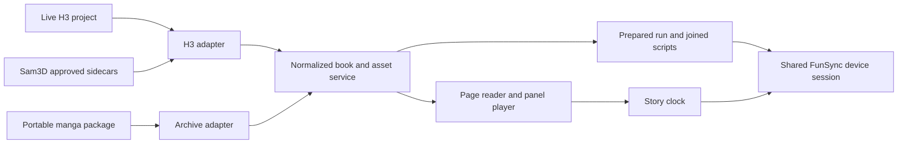

# Animated manga reader and player

Design document, researched against the local repositories and project on 24 September 2026. The reader has now been implemented; see [the usage and verification guide](MANGA_READER.md) for its current behavior and limits. The sections below retain the design rationale and acceptance targets. Physical device acceptance remains outstanding.

## 1. Product and first milestone

Add a **Manga** tab to FunCiv Player. Open an H3 Animator project or a portable manga package, read its original pages, and click an animated panel to enlarge it and play its video. Keep the page's reading order, speech bubbles, bookmarks, zoom, and page navigation. Support both animations with speech bubbles and clean animations without them.

Videos work immediately without funscripts. Approved scripts added later by Sam3D become available after refresh. Device playback uses the existing FunSync connections and script joining primitives; it does not require exporting a movie. Reading-time controls include a quiet pause, repeating the panel with its motion, and holding the image while extending the script's existing rhythm.

The first milestone is the actual `Now_Living_project`: all 140 pages remain readable, and page 2's four selected animations open from their panel positions, play in order, and support bubble toggling. This gives us a concrete result before adding motion and packaging.

## 2. What exists today

Sources inspected:

- H3 project: `/media/unraid/davinci/H3-Animator/Now_Living_project/`.
- H3 implementation: `/media/p5/ComfyUI-H3-Animator/h3_animator/`, particularly `core.py`, `takes.py`, `viewer.py`, and `catalogue.py`.
- Sam3D integration: `/media/p5/ComfyUI-Sam3D-to-Funscript/docs/h3-project.md` and `sam3d_funscript/h3_project.py`.
- FunCiv's Composer playback, device sessions, main-process service, and motion timeline helpers.

The project has 140 pages and 715 indexed panels. Its declared reading direction is **left to right**. Page 1 has no detected panels and must still be displayed normally. Page 2 has four horizontal panels spanning a 1500 × 2122 page. There are also render records elsewhere; importing must not be hardcoded to page 2.

Page 2's current layout is `10db92989d498f07`. Its selected videos are:

| Panel | Selected take | Resolution | Frames at 24 fps | Video duration |
| --- | --- | --- | --- | --- |
| 1 | `take_0001` | 1280 × 448 | 192 | 8.000 s |
| 2 | `take_0008` | 1312 × 448 | 107 | 4.458 s |
| 3 | `take_0016` | 1280 × 448 | 243 | 10.125 s |
| 4 | `take_0001` | 1248 × 448 | 124 | 5.167 s |

Their combined video time is **27.750 seconds**. All four have audio, clean video, video with baked speech bubbles, a transparent bubble overlay, and a first-frame image. No matching funscripts were present beside these selected takes when inspected.

Some aggregate catalogue/index information is stale. For example, an older timing entry for panel 3 does not describe its current 10.125-second video. The importer must inspect current layouts and completed take records, then probe the selected media. Requested generation duration is not playback duration.

The page 2 layout also carries an unreviewed geometry/order warning. Follow its explicit order, expose an optional reader order correction, and retain that correction separately from H3.

## 3. Reader interface

### Main layout

- **Top bar:** book title, page number/jump, previous/next page, reading mode, bubbles, fullscreen, and a compact device indicator.
- **Collapsible left drawer:** virtualized page thumbnails, bookmarks, and optional chapter navigation. Badges distinguish pages containing animations and scripts without hiding ordinary pages.
- **Reading surface:** original page on a quiet background. Animated panels receive a small play marker on hover/focus; the page remains readable without large permanent overlays.
- **Bottom transport:** previous panel, play/pause, next panel, elapsed/duration, seek bar, volume, and autoplay mode. Shown while focused on a panel and accessible in fullscreen.
- **Optional details drawer:** selected take, video availability, bubble capability, script status, and refresh/relink actions. File paths and processing details stay out of normal reading controls.

No always-visible Composer timeline or clip catalogue is needed in this tab. A compact panel strip can show the current page's sequence and support jumping between panels.

### Reading modes

1. **Page:** default. Fit page or fit width, zoom and pan, click an animated panel to focus it. Clicking a static panel can enlarge its artwork too.
2. **Guided panels:** move through the layout's ordered panels. Animate those with videos; show static artwork for the others.
3. **Continuous reading:** vertical page scrolling with the same clickable panel behavior. Virtualize pages and release offscreen decoders.

Single-page mode is the first implementation. Continuous reading follows within the reader work. Two-page spreads are a later enhancement; RTL/LTR/vertical metadata and explicit panel order are supported from the start.

### Panel interaction

Click a panel → enlarge its page crop into the focus surface → reveal its decoded animation → finish on the last frame or advance according to autoplay. Escape returns to the same page position and zoom. A visible **Back to page** button provides the same action.

Use the source page crop during the zoom, then a short crossfade into the actual video. Some H3 takes use the supplied reference in the middle of the animation; their opening frame may differ from the original panel. The transition should accommodate this instead of assuming identical pixels.

Preserve art geometry. Use each panel's bounds/polygon and the take's `transform.content_box`/`scale_xy` to align the video and overlay. Fit the entire panel by default; wide strips are not automatically cropped into portrait video. Offer fit width plus pan for closer reading. Respect reduced-motion preferences with an immediate focus change.

### Controls and persistence

- Space: play/pause, except when typing or interacting with a control that owns that key.
- Arrow controls and visible buttons: previous/next panel, respecting reading direction; separate explicit page navigation.
- `F`: fullscreen; `B`: bubbles; Escape: close a drawer, then leave focus/fullscreen as appropriate.
- Seek by click, drag, and keyboard in both directions. Rapid seeks preserve the latest intent and cannot resume an obsolete panel.
- Save page ID, panel identity, local video time, zoom, reading mode, and bubble preference in app storage. Restore paused; connecting a device does not start playback.
- On narrow windows, drawers become overlays and transport controls wrap. No narrow nested list with vertically broken labels.

## 4. Speech bubbles and clean viewing

Expose one clear **Bubbles: on/off** control, remembered per book and usable during playback. Preserve available assets and capabilities rather than assuming every take was generated in switchable mode.

| Available assets | Rendering behavior |
| --- | --- |
| Clean video + transparent bubble overlay | Preferred: one video decoder with an independently visible overlay. Toggle without seek, restart, audio interruption, or script changes. |
| Separate clean and baked-bubble videos, no usable overlay | Support both variants. Preserve playback position and intent; verify timeline compatibility before treating the switch as equivalent. A short buffering pause is acceptable. |
| Baked-bubble video only | Play it; show that a clean version is unavailable for this panel. |
| Clean video only | Play it; show that speech bubbles are unavailable if there is no matching overlay. |
| Static artwork with a valid clean reference | Use the original crop for bubbles-on and clean artwork for bubbles-off where alignment is valid. |
| Original page only | Keep its original text. Do not claim that a toggle can remove text baked into an image. |

The default full-page reading view uses the original page. A clean page view can replace supported panel areas with clean references while preserving gutters and panel masks. If some areas lack clean artwork, report partial availability and keep those original areas intact. Focused panels and videos support their own actual capabilities independently.

Overlay images remain in the video's coordinate system and receive the same contain/zoom/pan transform as the video. Source bubble polygons are page coordinates; they cannot be applied directly as video coordinates. Existing overlay PNGs are the preferred visual source. Optional OCR text can support an accessible transcript/search later; it does not replace the original bubbles.

The existing H3 `viewer.py` demonstrates the clean-video-plus-overlay approach. Reuse its asset convention, not its exported HTML as executable content inside Electron.

## 5. Import contract and project refresh

The reader imports an H3 folder without requiring ComfyUI to run and without rewriting H3 files.

1. Read and validate `project.json`, supported schema version, page order, image paths, dimensions, and reading direction.
2. Follow each page's `current.json` to its active layout. Read that layout's explicit panel order, bounds, polygon, and revision.
3. Discover committed `takes/take_*/render.json` records. Ignore failed, incomplete, deleted, and retired-layout takes. Report damaged metadata locally without discarding the rest of the book.
4. Follow `main_take.json` when it points to a valid completed take. Otherwise use the latest valid completed take, matching H3's selection behavior. Take-number gaps are normal after deletion.
5. Resolve variants, overlay, first frame, and source transforms. Probe selected videos lazily with bounded concurrency; use actual media timing, not cached requested seconds.
6. Discover funscripts for the selected take and supported axes. Keep animation, bubble, and motion availability as separate properties.
7. Produce an immutable normalized reader snapshot. Missing media leaves the original page readable with a local explanation/relink option.

Use filesystem watching as a convenience, plus explicit **Refresh project** and a modest foreground refresh policy for NAS paths where watchers may miss changes. Debounce writes and accept completed records only; do not parse a file halfway through a save.

Updates are discovered in the background, but the entire prepared run keeps its selected takes and script versions until the reader explicitly applies updates or starts a new run. A temporary pause is not permission to replace its contents. The UI can announce new media/scripts without rebuilding the player on every metadata refresh. Selecting a different take changes its associated script binding and invalidates any prepared motion run.

Keep reader overrides, bookmarks, title/cover preferences, and chapter groupings in FunCiv storage. A user can override a take or reading order for this reader without changing H3's `main_take.json` or layout.

### Identity and normalized data

Use a book UUID, edition/revision, page ID, layout revision, panel ID, take ID, and asset hashes. A reused panel ID after recutting a page is not sufficient to establish the same panel or script.

Proposed entities:

| Entity | Core fields |
| --- | --- |
| Book | schema version, UUID, title, reading direction, ordered pages, optional chapters, asset table |
| Page | ID, source image/hash, dimensions, layout revision, ordered panels |
| Panel | ID, page-space bbox/polygon, static/clean artwork, available takes, selected take, optional reader order override |
| Take | ID, clean/baked video references, overlay, poster, transform, measured timing, audio presence |
| Motion binding | take/variant identity, axis files, validation status, video hash when available, offset, script hashes |
| Presentation | reading-time mode, before-play hold, advance policy, repeat-audio policy, extension budget, rhythm source/range, per-panel gain, transition preference; book defaults with panel overrides |
| Reader state | book/edition identity, page/panel/local time, preferences, bookmarks; stored outside source/package |

## 6. Autoplay and media clock

Autoplay is independent of funscript availability. A video without a script still plays and advances normally; a script adds device motion to that video.

Provide three choices:

- **This page:** recommended default. Advance through animated panels in order and pause at the page boundary.
- **Continuous:** advance through pages in order. Static panels/pages remain part of the story, with a configurable reading hold or a wait-for-click policy.
- **Manual:** play only the chosen panel, then stop.

Until a different preference is chosen, static content waits for the reader and page boundaries pause. A page containing only stills is never silently skipped. Timed still holds, when enabled, are explicit entries in the playback sequence, not estimates inferred from motion files. Independently select **Pause to read**, **Loop panel**, or **Extend motion** as the reading-time behavior, described in section 12.A. These modes do not change the book's panel order.

Create a dedicated `MangaPlayer` with a `StoryClock`. Composer's player is driven by a separate song and muted clips; manga playback is driven by the selected panel video's own media timeline and audio.

For a prepared run:

`storyTime = segment.startTime + activeVideo.currentTime`

This initial formula assumes full videos at 1×, starting at source time zero. Trimming is not required for the first reader. If source ranges are introduced later, the mapping becomes `segment.startTime + (activeVideo.currentTime - segment.sourceIn) / segment.rate`. Use that same mapping for script actions; a source offset must not be counted as elapsed reading time.

Each video segment uses its measured duration and defined source range. Keep high-precision timing internally; round once when compiling millisecond script actions. Page 2's cumulative video boundaries are 0, 8, 12.458333, 22.583333, and 27.75 seconds.

Preload the next video with a second decoder. Only the active video is audible. Zoom animations and quiet reading pauses freeze the playback clock. **Loop panel** and **Extend motion** are explicit timed segments in a prepared run, with their own clock mapping; they cannot use a frozen video's currentTime as the device clock. Keep the original video's position, repeat count, and total prepared-run time separate. On stalls, asset changes, or seeks, pause device output and resume only after the new position is established.

Use a playback state machine: reading → focusing → buffering → playing/paused → repeating/extending/holding → advancing → reading/finished, with generation tokens for obsolete asynchronous work. Separate desired play state from a temporary buffering pause. Repetition and motion extension follow the selected reading-time policy; they do not start just because a video emitted `ended`.

During ordinary video playback the video media clock is authoritative. During an explicitly selected motion-only extension, the prepared segment uses a monotonic clock that pauses and seeks through the same event adapter. Frame callbacks can update overlays smoothly but are best-effort callbacks, not a replacement for media/device timing. See [MDN's requestVideoFrameCallback documentation](https://developer.mozilla.org/en-US/docs/Web/API/HTMLVideoElement/requestVideoFrameCallback).

## 7. Sam3D scripts and device playback

Sam3D already has **H3 Animator · Funscript Workspace**, with workflow `workflows/03_h3_project.json`. Approved exports are saved beside the selected video:

```text
takes/take_0016/
  video_clean.mp4
  video_clean.funscript
  video_clean.surge.funscript
  video_clean.sway.funscript
  video_clean.twist.funscript
  video_clean.roll.funscript
  video_clean.pitch.funscript
```

Map the base file and supported axis suffixes through the existing axis conventions. Scripts use that video's local time. Validate timestamps, positions, axis data, duration bounds, and duplicate-time behavior before joining them.

Important compatibility rules:

- H3's selected main take and Sam3D's latest-take review listing can differ. Match the exact selected take; never silently substitute another take because it has a script.
- Prefer the matching video stem. A script may be reused between clean and baked variants of the same take only after their shared timeline is verified. Different takes remain distinct.
- `.s3f-h3.json` exclusions control processing/review. They do not mean that story pages should disappear or that the reader should ignore an existing approved script.
- Editor drafts live in ComfyUI's output store. They are not automatically discovered beside H3 videos; draft playback would require a separate explicit integration later.
- Existing sidecars do not provide a complete hash-bound contract. Retain compatibility with matching sidecars while identifying the binding as legacy. Propose an optional future motion descriptor containing take ID, video hash, duration, axis hashes, review status, and any offset.

Expose motion as a separate status: **No script**, **Ready**, **Needs checking**, or an explicit reader annotation **Motion not needed**. Do not infer which scenes need motion. Missing motion is not an error that blocks reading.

### Joining and device control

Reuse `remapActions`, action validation, and `spliceActions` from Composer/Motion Studio. Build a motion timeline in narrative order, mapping each script from video-local time to the prepared run's segment offset. Preserve pauses and bound transition blending so it cannot create an unintended long movement between clips.

Unscripted segments suppress device motion and automatic filler. The selected **Extend motion** mode applies only to the current scripted panel's reading interval; it does not carry motion into a different unscripted panel. Derive the extension from that panel's validated motion phrase, rather than generating a generic beat pattern. Stop/hold behavior must be explicit for each existing transport; a flat script alone is not the whole state machine.

Start with **page-sized prepared runs**, including any allocated loop or motion-extension segments. Upload the joined page script once for Handy/Autoblow, then seek and resume against the same playback clock as panels change. Skipping unused reading time must jump to the prepared next segment, not change its offsets underneath an uploaded script. Pause before preparing the next page. This supports direct preview without rendering a movie and makes reading pauses natural. Longer chapter runs follow once file-size/action limits and transitions have been verified on devices.

Generalize `ComposerDeviceSession` into a shared playback session accepting owner, title, clock adapter, and compiled scripts. Add a `manga` owner to the app's source mutex and filler guards. Preserve configured device transforms and routing. The clock adapter must implement the event/property contract required by the sync engines; merely exposing a numeric currentTime is insufficient.

Reader controls show **Devices off**, **Connected · not prepared**, **Preparing**, **Ready**, or **Paused/needs preparation**, with useful actions. Preparing does not start playback. Bubble toggles, zoom, and drawer changes do not invalidate preparation; changing a take, source range, order, offset, script, or compiled reading-time policy does. Display **Repeating panel** or **Extending motion** separately from device connection status.

Device controls must cover play, pause, reverse/forward seek, next/previous panel, replay, buffering, fullscreen, tab changes, disconnect, and source takeover. Start at normal playback speed; expose other speeds with device sync only after transport behavior is verified.

## 8. Portable manga package

Propose a `.fcmanga` extension containing a versioned ZIP/ZIP64 archive. It is a self-contained reader edition, with all original pages and the selected animations, bubble assets, and available approved scripts. It works on another machine without H3, Sam3D, the original absolute paths, or ComfyUI.

```text
Now_Living.fcmanga
  manga.json
  pages/...
  media/...
  overlays/...
  artwork/...
  motion/...
  thumbnails/...
```

`manga.json` contains the normalized book model, relative asset references, asset sizes/hashes, reading order, geometry, take selection, bubble capabilities, measured media information, motion bindings, and authored presentation defaults. Include reading-time modes and rhythm source ranges so an exported book can reproduce the reviewed behavior. Keep compiled extension scripts reproducible from their source script hash, parameters, and algorithm version; they do not overwrite approved source sidecars. Source provenance can retain relative H3 identities; local absolute paths and authoring prompts are unnecessary.

The export dialog provides:

- Full book by default, with an optional selected-page range for testing/sharing.
- Both bubble and clean viewing supported by default: clean video + overlay where available. Include separate baked video when required to preserve the source's presentation; offer an option to retain both original encodes.
- All original pages, plus clean panel artwork needed for supported clean still views.
- Selected takes and approved scripts by default; optional alternate takes as a larger edition.
- Estimated size, included/missing asset summary, progress, and cancellation.

Do not transcode video on normal export. Deduplicate identical assets by hash. Keep already compressed media stored without recompression; compress small JSON/text as appropriate. Reader progress stays in app storage and does not rewrite a multi-gigabyte book file.

Use a ZIP64-capable archive layer in the main process with bounded-memory entry streams. The existing JSZip dependency is not a sufficient reason to load a whole video book into renderer memory; its documented full-result and ZIP64 limits warrant a separate archive implementation. [JSZip limitations](https://github.com/Stuk/jszip/blob/main/documentation/limitations.md).

Evaluate a lazy central-directory reader such as yauzl and a compatible ZIP64 writer in a small packaging spike. Yauzl supports opening individual entry streams without buffering the whole archive. [Yauzl documentation](https://github.com/thejoshwolfe/yauzl).

For v1, index the archive and extract required assets on demand into a hash-addressed cache, prefetching the next panel. This keeps media seeking ordinary and avoids implementing random access inside compressed entries. Cache size limits, cleanup, cancellation, and disk-space errors belong in the same milestone. Direct byte-range playback from stored archive entries is a later optimization.

Validate entry paths, normalized duplicates, sizes, and hashes; reject path escape/symlink entries and enforce extraction limits. Write exports to a temporary file, verify them, then atomically replace the destination. If a source asset changes during export, retry or identify the affected panel instead of publishing an inconsistent edition. Do not execute packaged HTML or workflow code.

When scripts are added later, export a new edition using the same book UUID and a new revision. Preserve reading progress by stable page/panel identity where valid; a changed layout must not bind old scripts or offsets to new artwork by accident.

## 9. Integration map

| Area | Proposed work and reuse |
| --- | --- |
| Navigation | Add Manga to `renderer/components/nav-bar.js`, view mounting in `renderer/js/app.js`, container/styles in `renderer/index.html`, and translated labels. |
| Reader core | New `packages/manga-core/` for normalized models, order, capability resolution, run construction, and script binding/joining. Reuse Composer motion primitives. |
| H3 adapter | New main-process adapter for current layouts, take selection, assets, sidecars, probing, and refresh snapshots. |
| Main process | Dedicated `electron/manga-ipc.js` and service using existing dialog/job patterns; main-renderer-only IPC and registered roots. |
| Renderer | `renderer/manga/` with reader view, page surface, panel focus, transport, details drawer, and `MangaPlayer`/clock adapter. |
| Devices | Extract shared device session behavior, add Manga source ownership, and keep Composer integration regression-tested. |
| Packages | Archive adapter implementing the same asset interface as a live H3 folder, plus export/import jobs and cache. |
| Tests | `tests/manga/` synthetic fixtures and UI/device tests, plus relevant existing Composer regressions. |

Serve registered assets through a narrow media protocol, such as `manga-media://<book>/<asset>`, with proper byte-range handling and MIME types. Include the scheme in the appropriate image/media CSP directives without bypassing CSP. Electron provides custom protocol handlers and streaming scheme support; implement and test against this app's installed Electron version. [Electron protocol documentation](https://www.electronjs.org/docs/latest/api/protocol).

Architecture:



## 10. Delivery sequence and acceptance

| Stage | Deliverable | Acceptance gate |
| --- | --- | --- |
| 0. Playback integration spike | Two synthetic panel videos, a stable playback-clock event adapter, and a joined test script with a repeated/extended reading segment. | Prove pause, seek, buffering, repeat boundaries, early exit from an extension, panel transitions, and source takeover before relying on the existing device integration in the reader architecture. Hardware confirmation remains an explicit gate. |
| 1. Project adapter and page reader | Manga tab, open/recent books, H3 discovery, page navigation, thumbnails, reading position. | All 140 pages open; page 1 works without panels; current page 2 takes selected correctly despite stale index data; source project unchanged. |
| 2. Panel playback and bubbles | Click-to-focus transitions, audio/volume, seek, fullscreen, clean/overlay/baked variants, geometry alignment, quiet reading holds. | All four page 2 videos play; bubble toggling keeps media time, audio, and play state; escape restores page position; wide panels retain framing. |
| 3. Guided autoplay and reading modes | Ordered page runs, preload, page/continuous/manual modes, panel looping, direct focus transitions, continuous reader layout, and optional in-page animation. | Page 2 plays once in order and pauses at its end by default; configured loops work; static content is retained; stalls and rapid navigation cannot start stale media. |
| 4. Motion integration and extension | Sidecar discovery, bindings, joins, shared device session, prepared page runs, rhythm-preserving motion extension, looped motion, and early-exit handling. | Synthetic scripts align across boundaries; rhythm and axis phase survive repeats; insufficient rhythm data falls back clearly; unscripted sections stop output; real Handy playback verified before calling hardware support complete. |
| 5. Portable editions | Manifest, streamed ZIP64 export, on-demand import cache, both bubble presentations, authored pacing/audio/order, stable book identity, and edition compatibility. | A moved package plays with source folder unavailable; presentation matches live import; unsupported capabilities are explained; large-package tests keep memory bounded. |
| 6. Polish and recovery | Accessibility, narrow layouts, relinking, refresh behavior, performance tuning, documentation. | Fullscreen/keyboard controls usable, broken panel does not block book, NAS refresh is recoverable, Composer/device regression checks pass. |
| 7. Accepted follow-on improvements | Optional loudness analysis/gain suggestions and script/metadata update packages with rollback. | Suggestions preserve deliberate quiet audio; an update applies only to its matching base edition, reproduces the new presentation, and can be rolled back without recopying unchanged video. |

Stage 0 establishes the clock contract before the main UI work; stage 4 completes its integration and hardware acceptance. Keep initial playback at 1× until that behavior is established. A missing physical device need not block the independent page reader, but device support remains unverified until tested.

### Meaningful verification

- Unit fixtures: main-take selection versus latest take, deleted-number gaps, stale indices, malformed records, layout changes, RTL/vertical order, empty/static pages, exact duration accumulation, and variant capabilities.
- Motion fixtures: known actions on two different videos, source offsets, missing axes, unscripted gaps, script replacement, mismatch handling, and no action leakage after a source takeover.
- Reading-extension fixtures: exact rhythm/phrase durations, position continuity at the wrap, consistent multi-axis phase, irregular/nonrepetitive scripts, extension-budget exhaustion, repeat audio policy, early Next, immediate Stop, and no motion leaking into an unscripted next panel. Compare compiled output against known source phrases rather than merely snapshotting the algorithm's own output.
- UI integration: clicking and seeking both directions; Space outside/inside inputs; bubble toggle while playing; return-to-page zoom; page boundaries; fullscreen; rapid repeated panel selection; refresh during playback.
- Archive integration: export/import round trip, both bubble views, move package away from source, corrupt/missing asset, traversal/duplicate entries, cancellation, low disk space, ZIP64-scale media, and bounded cache/memory behavior.
- Hardware acceptance: Handy at known panel boundaries, reverse seek, pause during buffering, replay, script refresh, and leaving Manga for Composer. Additional transports tested individually; simulator results are not presented as physical testing.

Use synthetic artwork/videos for committed fixtures. The user's project remains a local acceptance dataset rather than being copied into the repository.

## 11. Defaults and boundaries

Recommended starting defaults: original-page reading, bubbles on, H3's selected main take, fit entire panel, page autoplay with page-boundary pauses, static content waiting for input, devices off until explicitly prepared, and packages preserving the full book.

The page-boundary default is a recommendation pending reader preference; all three autoplay modes are included. Both bubble and non-bubble viewing are confirmed requirements.

Later extensions: two-page spreads, transcript/search from available OCR, chapter-length device preparation, generic CBZ/PDF imports, alternate-language bubble layers, and a direct draft-workspace bridge. Video generation, pose analysis, automatic scene classification, and modifying source H3 layouts are outside this reader's initial scope.

The main implementation risks are source-to-video geometry, exact take/script association, media-clock behavior with cloud devices, and large portable archives. Each has a specific acceptance gate above; none prevents building the useful static/animated reader first.

## 12. Review: gaps and useful additions beyond the original feature list

All review suggestions in this section were accepted, including the user's loop and motion-extension reading modes. Their implementation is described in the reader guide. The delivery table records the planned stages and acceptance targets. “Optional” describes a reader setting, not an unaccepted requirement.

### A. Separate time to read from animation duration — initial release

A four-second animation can contain more dialogue than someone can read in four seconds. Autoplay based only on video duration can rush the story even when every video is playing correctly.

Add an optional **Read before playing** pause and three choices for **While reading**, configurable per book with per-panel overrides:

| Mode | Picture | Motion | Audio |
| --- | --- | --- | --- |
| Pause to read | Hold the panel or its last frame. | Stop; remain paused until the reader continues. | Stop after the original playback. |
| Loop panel | Repeat the complete panel animation. A reviewed loop range can be added as an advanced setting later. | Repeat the matching script in lockstep with each video pass. Video-only panels can loop without motion. | Proposed default: audio on the first pass; optional audio on every repeat. |
| Extend motion | Hold the last frame with the chosen bubble visibility. | Continue a repeatable phrase from this panel's script, preserving its overall rhythm, timing variations, range, and shape. | Stop after the original playback. |

The normal no-extra-reading-time autoplay behavior remains available. Choosing Loop panel or Extend motion is explicit. Pause/Stop always requests motion stop immediately; **Next panel** exits reading mode using the transition rules below. Bubble toggling and zoom remain usable during all three modes.

**Rhythm extension:** use the current approved script as the source. Prefer a recent stable phrase containing complete cycles; also allow selecting a source interval and previewing it. Repeat the phrase's actual relative action timestamps and positions, preserving unequal beat spacing instead of replacing it with a constant-speed wave or stretching the whole script. Avoid a terminal flat hold or an incomplete final stroke as the automatic candidate. Keep intensity/range unchanged by default. Reuse the existing interpolation/join primitives, but implement and test phrase selection separately; current music beat generation does not establish the rhythm of a manga motion script.

Validate the join from the original ending into the phrase and between phrase repetitions. Choose compatible cycle boundaries and use a short bounded blend only where needed. Preserve a shared phrase length and phase across axes; do not choose a different repeating period independently for each axis. If the source has no reliable repeating phrase, offer a manually selected interval or Pause to read instead of inventing a rhythm. No script means Extend motion is unavailable for that panel; it can still pause or loop its video.

**Bounded preparation:** offer an extra-time budget such as 30, 60, or 120 seconds plus custom duration. Round motion extension to complete phrases and show the actual prepared duration. Support **Next when I choose** and **Advance after extra time** separately. An indefinite quiet hold is straightforward; uploaded motion requires a finite prepared sequence. If the reader is still reading when its budget ends, pause and offer more time. Do not promise unlimited seamless motion by silently running beyond the uploaded script. A continuous refill mechanism can be considered only after transport testing.

The prepared page reserves explicit segments for repeats or motion extension. Ordinary playback follows video time; repetition maps each video pass to its prepared segment; held-image motion uses a monotonic extension clock that pauses with the transport. Following panels retain fixed compiled offsets. On an early Next, skip the unused extension by seeking to the next prepared segment rather than shifting the remainder of an already uploaded script.

**Leaving a repeat smoothly:** compile an exit transition from a known phrase boundary. During active extension, Next can finish the current cycle and then enter that transition; show that it is finishing the cycle. Stop and explicit immediate navigation do not wait for a cycle. An immediate move needs a stop-and-reanchor path, including a transition prepared from the current motion state when required by the transport. A blend calculated for the planned end of a 60-second tail cannot guarantee continuity if the reader leaves at an arbitrary earlier phase. The early integration spike must prove this behavior with existing Handy commands; do not mask an upload or repositioning pause by showing continued synchronized playback.

Keep source funscripts untouched. Store the chosen reading mode, phrase range, extra-time budget, audio policy, and advance policy as presentation settings. Derived compiled scripts record their source hash and generator version so a changed source invalidates preparation.

Start with reader-selected holds, not automatic OCR-based reading-time estimates: OCR coverage is incomplete and text density does not determine everyone's reading speed. Store book defaults and optional panel overrides. Author-supplied pacing can travel with a package, while the reader can override it locally.

Acceptance: quiet holds remain still; panel loops repeat video and script together; extended motion preserves the selected phrase's timing and axis relationships while the image stays visible. Each mode supports bubbles, pause, resume, and Next. Test different exit phases and time-budget exhaustion. Continuing advances exactly once, and no motion continues into a different unscripted panel.

### B. Treat the story clock as a real playback interface — architecture correction

The existing Handy and Autoblow engines bind to `playing`, `pause`, `seeked`, and `ended` on a single `player.video` object. Their binding methods do not directly listen for `waiting` or `seeking`. Forwarding raw events from alternating decoder elements is insufficient: a panel ending is not necessarily the run ending, and buffering or a seek must stop output before it finishes.

Keep one stable event source for the story clock and explicitly translate decoder events into run-level state. Pause output on seek start or inability to advance; resume only at the established media position. Suppress obsolete events from the inactive decoder, and emit the run's `ended` only at its real end. The media APIs distinguish buffering, seeking, and completion events. [Waiting](https://developer.mozilla.org/en-US/docs/Web/API/HTMLMediaElement/waiting_event), [seeking](https://developer.mozilla.org/en-US/docs/Web/API/HTMLMediaElement/seeking_event), and [ended](https://developer.mozilla.org/en-US/docs/Web/API/HTMLMediaElement/ended_event).

H3's standalone viewer also sets native video looping. The reader must own repeat behavior explicitly: native looping suppresses `ended` during forward playback, which would defeat an end-driven advance. Repeating a panel must reposition both media and motion.

This review moves the integration spike ahead of UI investment. Reusing device transports remains appropriate; seamless multi-video clock behavior must be demonstrated rather than inferred from Composer working.

### C. Freeze the whole prepared run during project changes — initial release

An immutable metadata snapshot does not make media files immutable. H3 can delete old takes while the reader still references their paths, and a new script can arrive for a later panel in the same prepared page.

Retain the selected media/script versions for the whole run. Read and validate script contents when preparing; pin cached media assets needed for that run where practical, especially from the NAS. Use bounded background copying and hash validation without rewriting sources. If an uncached asset disappears, pause and offer its original panel plus refresh/relink; never silently substitute a different take under the old script.

Applying updates creates a new run revision and requires new device preparation. A new render elsewhere in the book should not interrupt current playback. Acceptance includes replacing a script for the next panel, deleting a take, and disconnecting the source share during a run.

### D. Avoid a full zoom-out and zoom-in between every panel — initial interaction design

Repeated camera travel can make a sequence tiring and obscure its continuity. In guided autoplay, stay in the focused reading surface and transition directly to the next panel, with a small page overview showing location. Return to the page on command or at the configured page boundary.

Add an optional **Animate in page** mode in stage 3: play inside the panel's original mask, keeping neighboring panels and gutters visible. Allow only one active video/audio source. Preserve zoom and scroll position, distinguish a drag from a click, and never start playback just because a panel is hovered or scrolled into view.

### E. Give generated panel audio its own presentation controls — basic controls initially

Independent H3 clips can produce abrupt changes of ambience or loudness. Provide persistent book volume/mute and an optional per-panel gain override. If short edge fades are enabled, they affect audio gain only and must not change the video duration or motion offsets. Default gain remains unchanged; do not automatically suppress quiet dialogue.

Stage 7 adds loudness analysis and suggested gain correction, validated with listening tests. Avoid overlapping speech from neighboring panels or using an audio crossfade as an excuse to overlap their video/script timelines.

### F. Model incomplete books without treating ordinary pages as failures — initial release

Most of this project's panels currently have no animation. Reporting hundreds of missing-video or missing-script errors would make the interface misleading.

Distinguish **Still panel**, **Animation available**, **Motion available**, and **Broken linked asset**. Absence alone is ordinary; an asset declared in the selected take/package that cannot be read is a fault. Keep separate counts for pages, animated panels, and scripted panels. Do not use a single ambiguous “Ready” badge for all three.

Add a book details action to inspect actual broken links, invalid scripts, and metadata issues. It should take the reader to the affected page/panel, not require finding a path in logs.

### G. Preserve authored presentation and handle package updates — schema now, patches later

The package must carry selected takes, optional reading-order corrections, panel pacing, and audio gain defaults. A package export should reproduce the reviewed reading experience. Personal bookmarks, current position, and device settings remain separate.

Record minimum reader/schema requirements and required capabilities so an older reader explains unsupported behavior instead of silently ignoring it. Define how a moved live project or newer edition reconnects to its book identity; use stored identity and content evidence rather than folder basename alone, and avoid merging different books solely because they share a cover.

Stage 7 adds a **script/metadata update package** to avoid redistributing all video when only scripts or presentation change. Bind updates to an exact base manifest revision and asset hashes, validate before applying, and allow rollback. The first packaging milestone exports complete editions. Describe these as reader editions: editable ComfyUI drafts, workflows, and generation history require a separate authoring backup.

### H. Narrow the first visual milestone — delivery improvement

Prove the experience on page 2 with single-page reading, click-to-focus, bubble toggling, reliable transport, reading holds, and page autoplay. Keep the remaining pages available as stills. Test geometry on an additional synthetic irregular panel layout so implementation does not assume every book contains four horizontal strips.

Continuous scrolling, in-page playback, optional audio gain suggestions, and incremental packages build on this first validated player in their assigned stages. They remain accepted planned features while the first visual milestone establishes whether the page-to-animation experience feels good.
